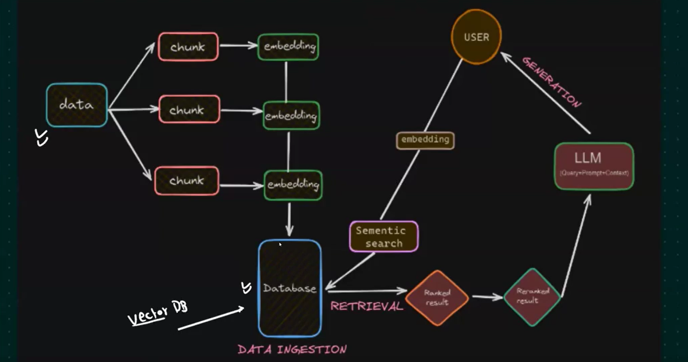

### Minimum requriement for RAG based Document portal project 
1. LLM Model  ## Groq(Free), OpenAI(paid), Gemini(15 days free), Claude , Huggingface (Free)
   For On-prem - try out  OLLAMA  - should have high performance system

2. Embedding models
   # Openai
   # Huggingface 
   # huggigface 
   # Gemini 

3. Vector Database 
   # In-memory 
   # on- disk
   # Cloud based --- AWS Bedrock, AstraDB etc 

## AWS secret manager for managing all the KEYS 

### Installing setup.py file 
# pip install -e .    " please ensure to have same syntax 
  The above makes the Document_Portal pacakge as part of the current virtual environment 
   
  For ex - Lang chain , Lan graph .... packages are available in PyPi 
  Projects - transformed to Package using setup.py    setuptools 
  This pacakge then can be ported to PYPI reposiroty for public usage like lang chain, numpy .... etc 
   RAG Architecture
   
